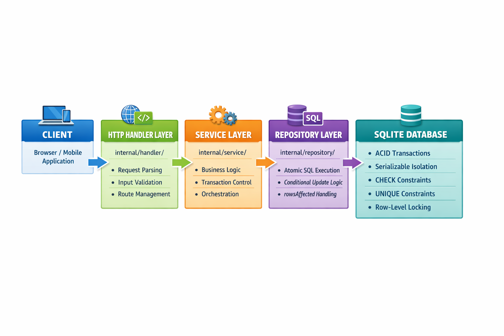

<h1 align="center">🎟️ Event Registration & Ticketing System</h1>

<p align="center">
  <b>A highly-concurrent, race-condition-safe REST API for event registration (like Eventbrite).</b><br>
  Built with <b>Go</b> and <b>SQLite</b>.
</p>

<p align="center">
  
  
  
  
</p>

---

## 🌟 Overview

This robust project delivers a complete backend REST API tailored for event registration, built to safely handle extremely high concurrent traffic.

**The core architectural challenge solved in this application:**  
*Preventing overbooking when 100+ users try to simultaneously register for the **last available spot**.*

✨ Designed as part of an evaluation for the **Infosys and EGov Foundation DPI project integration**, this repository prioritizes fault-proof concurrency, atomic database operations, and clear, maintainable code.

## 🚀 Key Features

- **Concurrent Registration**: Resolves race conditions deterministically.
- **RESTful API**: Intuitive endpoints for viewing events, creating new events, and registering users.
- **SQLite Database**: Lightweight storage featuring rigid schema constraints (`CHECK (available_spots >= 0)` and `UNIQUE` composite keys).
- **Atomic Transactions**: Leverages `sql.LevelSerializable` isolations and `UPDATE` conditional locks avoiding standard CRUD race conditions.
- **Comprehensive Testing**: Includes an aggressive concurrent bomb-test spinning 100 parallel goroutines attempting to register for a 10-seat event at identical milliseconds.

## 📚 Documentation Reference

For maximum transparency and deep-dives into our architectural choices, please read the included supplementary documents:

* 📄 [**Design & Architecture Document**](./docs/design.md): In-depth explanation of our approach to preventing concurrency race conditions.
* 🤖 [**AI Tools Prompts**](./prompts/ai-prompts.md): A complete log of prompts used during the development of this application, honoring the submission transparency guidelines.

---

## 🏗️ System Architecture

Our repository follows a clean, modular Model-View-Controller (MVC) style layering commonly found in enterprise Go applications:

```text
📦 Event-Registration-System
 ┣ 📂 cmd/              # Main application entrypoint (main.go)
 ┣ 📂 internal/         # Private application code (not importable by other projects)
 ┃ ┣ 📂 handlers/       # HTTP Request Handlers (Parsing JSON, validation)
 ┃ ┣ 📂 middleware/     # HTTP Middleware (Auth, CORS, Logging)
 ┃ ┣ 📂 models/         # Core data structs (User, Event, Registration)
 ┃ ┣ 📂 repository/     # Database operations & locking logic (The Data Layer)
 ┃ ┗ 📂 services/       # Core business logic connecting handlers <-> repo
 ┣ 📂 pkg/              # Public facing utilities (Database connector)
 ┣ 📂 docs/             # Application design documents
 ┗ 📂 prompts/          # AI Transparency logic
```

### Architecture Flow Diagram



1. **Client (Browser / Mobile Application)**
   - Makes the initial HTTP request (`POST /api/register`).
2. **HTTP Handler Layer (`internal/handler/`)**
   - **Request Parsing**: Binds incoming JSON payloads to Go Structs.
   - **Input Validation**: Ensures valid user input and headers.
   - **Route Management**: Directs API traffic correctly.
3. **Service Layer (`internal/service/`)**
   - **Business Logic**: Validates event existence and capacity rules.
   - **Transaction Control**: Manages the flow of the booking process.
   - **Orchestration**: Communicates between the HTTP handlers and the repository layer.
4. **Repository Layer (`internal/repository/`)**
   - **Atomic SQL Execution**: Directly prepares and executes the data queries.
   - **Conditional Update Logic**: Specifically applies `WHERE available_spots > 0`.
   - **rowsAffected Handling**: Verifies if concurrent modifications succeeded.
5. **SQLite Database**
   - **ACID Transactions**: Guarantees registration integrity.
   - **Serializable Isolation**: Ensures transactions run sequentially without interference.
   - **CHECK & UNIQUE Constraints**: Physically blocks mathematical negative capacities and duplicate users.
   - **Row-Level Locking**: Isolates the event row while evaluating capacity.

---

## 💻 Tech Stack

- **Language**: [Go](https://go.dev/) (Golang)
- **Database**: [SQLite](https://sqlite.org/) (via `github.com/mattn/go-sqlite3` / `modernc.org/sqlite`)
- **Routing**: `net/http` standard mux

---

## 🛠️ Getting Started & Installation

### 1. Prerequisites
- **Go** (Version 1.21 or higher)
- **Git**

### 2. Clone & Setup
```bash
# Clone the repository
git clone <your-repository-url>
cd Event-Registration-System

# Download project dependencies
go mod tidy
```

### 3. Run the Server
Starts the API on port `:8080`. The database `event_registration.db` will be auto-generated with schema injected.

```bash
go run cmd/main.go
```

*(Server typically listens on http://localhost:8080)*

---

## 🧪 Validating the Concurrency Challenge (Tests)

To prove our race condition protection works flawlessly, an automated unit test forces 100 simultaneous concurrent users to attempt booking a 10-person event.

Run the test suite:

```bash
go test -v ./...
```
**Expected Outcome**: Exactly 10 successful registrations, exactly 90 graceful failures, no deadlocks, and `0` database discrepancies.

---

## 📡 API Endpoints Reference

### User Operations

#### `GET /api/events`
Browse all listed events displaying their total capacity and remaining available spots.
* **Returns**: `200 OK` (JSON Array)

#### `POST /api/register`
Register a user for an event.
* **Payload**: 
  ```json
  { "event_id": 1, "user_id": 2 }
  ```
* **Returns**: 
  * `200 OK`: `{"message": "Registered successfully", "status": true}`
  * `409 Conflict`: If the event is fully booked or the user has already registered.

### Organizer Operations

#### `POST /api/events/create`
Organizers create a new localized event.
* **Payload**:
  ```json
  { 
    "title": "Tech Conference", 
    "description": "Annual tech meet", 
    "date": "2026-10-10T10:00:00Z", 
    "capacity": 100, 
    "organizer_id": 1 
  }
  ```
* **Returns**: `201 Created` with the newly assigned event payload details.

---

## 🛡️ Concurrency Strategy Explained (TL;DR)

Typical race conditions occur because of this application flow: `SELECT capacity` -> *If capacity > 0* -> `UPDATE capacity - 1`. During heavy concurrent load, 100 requests will read `< 0` simultaneously, creating 100 successful modifications.

**Our Defense Strategy:**
1. **Database Atomicity:** We condensed the Read and Write into a solitary atomic operation:
   `UPDATE events SET available_spots = available_spots - 1 WHERE id = ? AND available_spots > 0`
2. **Transaction Isolation:** Wrapped entirely within an `sql.LevelSerializable` database transaction.
3. **Database Constraints:** Utilizing `CHECK (available_spots >= 0)` and `UNIQUE(event_id, user_id)` schemas as a final, unbreachable physical barrier.

*Read the [Design Doc](./docs/design.md) for full context.*
